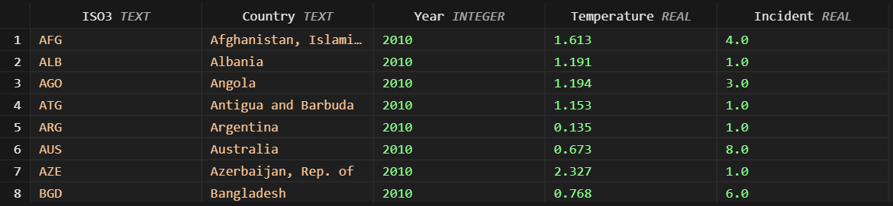

# Effects of Surface Temperature Change on Climate-related Disaster
The global climate change is a significant problem requiring urgent attention as it affects both human and nature. One of the most important issues concerning climate change is the increase in surface temperatures, leading to increased frequency and severity of climate related disasters. This data engineering project seeks to investigate how these changes in surface temperature are responsible for climate-related disasters. By processing historical records and applying sophisticated data analysis methods, this data engineering project attempts to explain these patterns. The main question for this project was- 

***How have different regions around the world been affected by changes in surface temperature in terms of climate-related disasters?***
<figure align="center" style="width:100%; backgroud-color: white">
    
</figure>

> ##### Used Data

By using two open datasets from well-established repository ***[`[INTERNATIONAL MONETARY FUND]`](https://www.imf.org)***, this project was performed. They provided a lot of information that was crucial to my research. The datasets are free-to-use for academic purposes ***[`[Terms]`](https://www.imf.org/external/terms.htm)***. For this project I used two datasets.
- **[`Annual Surface Temperature Change`](https://climatedata.imf.org/datasets/4063314923d74187be9596f10d034914/explore)**
- **[`Climate-related Disasters Frequency`](https://climatedata.imf.org/datasets/b13b69ee0dde43a99c811f592af4e821/explore)**

The extensive data points found in these datasets enabled me to make detailed analyses. To take full advantage of the datasets in this instance, I created and executed a data pipeline *[`[Source Code]`](https://github.com/tanvirtanjum/MADE-SS-24/blob/main/project/pipeline.py)* to help structure a workflow for the data backend.


<figure align="center" style="width:100%">
    
    <figcaption>Figure 1: ETL Pipeline</figcaption>
</figure>


Creating this pipeline was an important part of the project. Firstly, it was used to fetch the data from the source.


<figure align="center" style="width:100%">
    
    <figcaption>Figure 2: DB - Source 1</figcaption>
    
    <figcaption>Figure 3: DB - Source 2</figcaption>
</figure>


Then it was used to sort out the work conducted by merging and creating a singular format for data transference and analysis. Some of the steps included in the process were - data cleaning, transformation, and validation to ensure that all of the steps were in order and that the data flow was reliable. 


<figure align="center" style="width:100%">
    
    <figcaption>Figure 4: Final Merged Data</figcaption>
</figure>


By doing this, I was able to enhance the quality of the data while showing how important data engineering is to any project. 

>Following technologies were used-
`python`, `pandas`, `colorama`, `matplotlib`, `sqlite3`, `vs-code`

> #### Project Setup:
1. Download & install [`git`](https://git-scm.com/downloads). [Optional]
2. Clone the repository
```
> Open git-bash
> Go to your desired directory
	cd /d/example_directory
> Clone Repository
	git clone https://github.com/tanvirtanjum/MADE-SS-24.git
```

Or, Direct [`Download`](https://github.com/tanvirtanjum/MADE-SS-24/archive/refs/heads/main.zip) and unzip.

3. [`Download`](https://www.python.org/ftp/python/3.12.4/python-3.12.4-amd64.exe) & Install Python.

4. Install project dependencies. 
```
> Open cmd on repository's project folder.
	$projectRoot/project
> Type and Enter: pip install -r dependency.txt
``` 

5. Run the project pipeline using the pipeline shell script "$projectRoot/project/pipeline.sh"
```
> Open git-bash
> Go to the project root directory
	e.g- cd E:/Github/MADE-SS-24
> Type and Enter: sh ./project/pipeline.sh
> Check processed data on $root/data folder
```

6. Run the project pipeline testing using the test shell script "$projectRoot/project/test.sh"
```
> Open git-bash
> Go to the project root directory
	e.g- cd E:/Github/MADE-SS-24
> Type and Enter: sh ./project/test.sh
```


> #### License
This project is licensed under the MIT License. See the [`LICENSE`](https://github.com/tanvirtanjum/MADE-SS-24/LICENSE) file for more details.


> #### Important Links:
* [Pipeline Source Code](https://github.com/tanvirtanjum/MADE-SS-24/blob/main/project/pipeline.py)

* [Testing Source Code](https://github.com/tanvirtanjum/MADE-SS-24/blob/main/project/test.py)

* [Data Analysis Source Code](https://github.com/tanvirtanjum/MADE-SS-24/blob/main/project/Data_Analysis/data_analysis.py)

* Reports:
	* [Data Report](https://github.com/tanvirtanjum/MADE-SS-24/blob/main/project/data-report.pdf)

	* [Analysis Report](https://github.com/tanvirtanjum/MADE-SS-24/blob/main/project/analysis-report.pdf)
________________________________________________________________________________________________________________

# Organizational Information

# Exercise Badges

    
