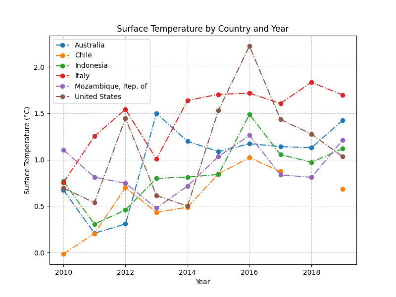
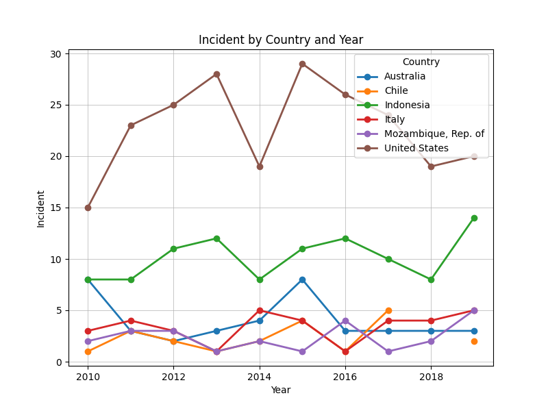
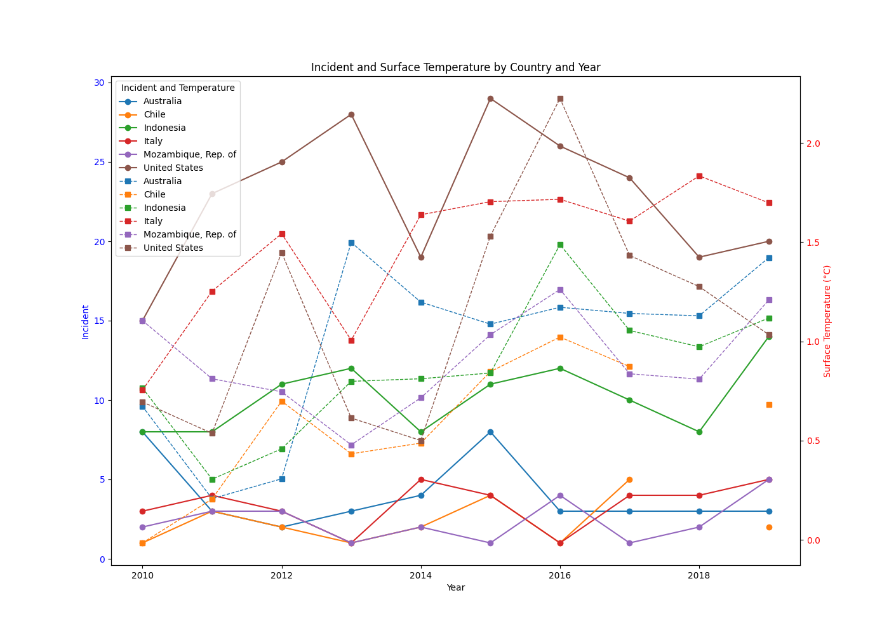

## Effects of Surface Temperature Change on Climate-related Disasters

> #### 1. Introduction
The global climate change is a significant problem requiring urgent attention as it affects both human and natural systems. One of the most important issues concerning climate change is the increase in surface temperatures, leading to increased frequency and severity of climate related disasters. This data engineering project seeks to investigate how these changes in surface temperature are responsible for various weather occurrences. By examining historical records and applying sophisticated data analysis methods, this project attempts to explain these patterns. The main question for this project was- 
How have different regions around the world been affected by changes in surface temperature in terms of climate-related disasters?

> #### 2. Used Data
Leveraging two open datasets from well-established repository [`[INTERNATIONAL MONETARY FUND]`](https://www.imf.org), this project was performed. They provided a lot of information that was crucial to my research. The datasets are free-to-use for study purpose [`[Terms]`](https://www.imf.org/external/terms.htm). For this project I used two datasets.
- [`Annual Surface Temperature Change`](https://climatedata.imf.org/datasets/4063314923d74187be9596f10d034914/explore)
- [`Climate-related Disasters Frequency`](https://climatedata.imf.org/datasets/b13b69ee0dde43a99c811f592af4e821/explore)

The extensive data points found in these datasets enabled me to make detailed analyses. To take full advantage of the datasets in this instance, I created and executed a data pipeline [`[Source Code]`](https://github.com/tanvirtanjum/MADE-SS-24/blob/main/project/pipeline.py) to help structure a workflow for the data back end.
<figure align="center" style="width:100%">
    
    <figcaption>Figure 1: ETL Pipeline</figcaption>
</figure>
Creating this pipeline was an important part of the project. Firstly, it was used to fetch the data from the source.
<figure align="center" style="width:100%">
    
    <figcaption>Figure 2: DB - Source 1</figcaption>
    
    <figcaption>Figure 3: DB - Source 2</figcaption>
</figure>
Then it was used to sort out the work conducted by merging and creating a singular format for data transference and analysis. Some of the steps included in the process were data cleaning, transformation, and validation to ensure that all of the steps were in order and that the data flow was reliable. 
<figure align="center" style="width:100%">
    
    <figcaption>Figure 4: Final Merged Data</figcaption>
</figure>
By doing this, I was able to greatly enhance the quality of the research while showing how important data engineering is to any research project. 

>Following technologies were used-
python, pandas, colorama, matplotlib, sqlite3, vs-code

For more data processing details visit [`[here].`](https://github.com/tanvirtanjum/MADE-SS-24/blob/main/project/data-report.pdf)

> #### 3. Analysis
For the data analysis, I selected six countries: `Indonesia (IDN), Mozambique (MOZ), Italy (ITA), The United States (USA), Chile (CHL), and Australia (AUS)`. The analysis focused on the period from `2010` to `2019`. That allows a comprehensive examination. By focusing on this specific time-frame, I ensured that the data was recent enough to be relevant, yet extensive enough to capture significant changes and developments. This targeted selection of countries and years provided a diverse and rich dataset, facilitating a robust comparative analysis.

I used line charts for the analysis.[`[Source Code]`](https://github.com/tanvirtanjum/MADE-SS-24/blob/main/project/Data_Analysis/data_analysis.py)
Initially, I examined separately, the changes in surface temperature and incidents occurred for the chosen countries within the specified time-frame. 
<figure align="center" style="width:90%">
    <table>
    <tr>
    <td style="width: 70%">
    
    <figcaption>Figure 5: Surface Temperature Line Chart</figcaption>
    </td>
    <td>
    <small>1. X-axis (Year):The x-axis represents the years from 2010 to 2019.
    2. Y-axis (Surface Temperature): The y-axis represents surface temperature, with values ranging from 0 to 2.</small>
    </td>
    </tr>
    </table>
</figure>

The graph effectively visualizes the differences in surface temperature over a decade across these six countries.

<figure align="center" style="width:90%">
    <table>
    <tr>
    <td style="width: 70%">
    
    <figcaption>Figure 6: Incidents Line Chart</figcaption>
    </td>
    <td>
    <small>1. X-axis (Year):The x-axis represents the years from 2010 to 2019.
    2. Y-axis (Incident): The y-axis represents the number of incidents, with values ranging from 0 to 30.</small>
    </td>
    </tr>
    </table>
</figure>
The graph effectively visualizes the differences in the number of incidents over a decade across these six countries.

After that, I merged two charts
<figure align="center" style="width:90%">
    <table>
    <tr>
    <td style="width: 70%">
    
    <figcaption>Figure 7: Incidents Line Chart</figcaption>
    </td>
    <td>
    <small>1. X-axis (Year):The x-axis represents the years from 2010 to 2019.
    2. Y-axis (Left: Incident): Represents the number of incidents, ranging from 0 to 30. 3. Y-axis (Right: Surface Temperature (°C)): Represents the surface temperature anomalies in degrees Celsius, ranging from 0 to 2.</small>
    </td>
    </tr>
    </table>
</figure>
The graph shows, over one decade and for six countries, how incidents relate to surface temperature anomalies, outlining general trends, spikes, and possible correlations. It provides a full view of how the incidents may be related to changes in temperature.

#### Findings:

1. United States (Brown Lines):
The graph shows large fluctuations for both incidents and temperature anomalies. The number of incidents peaks around 2013 and 2017, almost hitting 30 incidents; it dropped significantly in 2016. Temperature anomalies remain consistently high at close to 2.0°C.

2. Indonesia (Green Lines):
The incident profile shows a gradual rise, peaking in 2019 at just over 10 incidents. There is also a smooth rise for temperature anomalies, peaking around 1.0°C.
Australia (Blue Lines):

3. It indicates fluctuating incidents, with remarkable spikes in the years 2018 and 2019. According to temperature anomalies, they were gradually increasing and reached almost 1.5°C in 2019.

4. Chile (Orange Lines):
It shows quite stable and low incident rates, and temperature anomalies are low also, at around 0.5°C.

5. Italy (Red Lines):
The series depicts fluctuations for both incidents and temperature anomalies. The incidents are well below 10, with temperature anomalies of around 1.5°C.

6. Mozambique (Purple Lines):
The graphs show a minor increase of the incidents over the past years. The temperature anomaly has been slightly increasing, peaking at around 1.0°C.

> #### 4. Conclusions

1. Correlation observations:
There appears to be a correlation between higher temperature anomalies and increased incidents, particularly evident in countries like the United States and Indonesia. This suggests that rising temperatures might be associated with a higher frequency of incidents.

Further research might permit the study of the causes and variables of these correlations in more depth, trying to understand how climate change works to cause such societal and environmental incidents.

Overall, this analysis highlights the relationship between surface temperature anomalies and natural disasters.