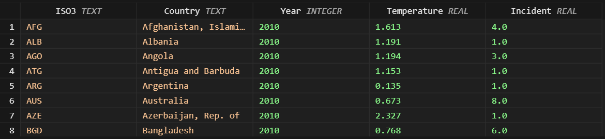

## __Effects of Surface Temperature Change on Climate-related Disasters__

> #### 1. Introduction

The global climate change is a significant problem requiring urgent attention as it affects both human and nature. One of the most important issues concerning climate change is the increase in surface temperatures, leading to increased frequency and severity of climate related disasters. This data engineering project seeks to investigate how these changes in surface temperature are responsible for climate-related disasters. By processing historical records and applying sophisticated data analysis methods, this data engineering project attempts to explain these patterns. The main question for this project was- 

***How have different regions around the world been affected by changes in surface temperature in terms of climate-related disasters?***

> #### 2. Used Data

By using two open datasets from well-established repository ***[`[INTERNATIONAL MONETARY FUND]`](https://www.imf.org)***, this project was performed. They provided a lot of information that was crucial to my research. The datasets are free-to-use for academic purposes ***[`[Terms]`](https://www.imf.org/external/terms.htm)***. For this project I used two datasets.
- **[`Annual Surface Temperature Change`](https://climatedata.imf.org/datasets/4063314923d74187be9596f10d034914/explore)**
- **[`Climate-related Disasters Frequency`](https://climatedata.imf.org/datasets/b13b69ee0dde43a99c811f592af4e821/explore)**

The extensive data points found in these datasets enabled me to make detailed analyses. To take full advantage of the datasets in this instance, I created and executed a data pipeline *[`[Source Code]`](https://github.com/tanvirtanjum/MADE-SS-24/blob/main/project/pipeline.py)* to help structure a workflow for the data backend.
<figure align="center" style="width:100%">
    
    <figcaption>Figure 1: ETL Pipeline</figcaption>
</figure>
Creating this pipeline was an important part of the project. Firstly, it was used to fetch the data from the source.
<figure align="center" style="width:100%">
    
    <figcaption>Figure 2: DB - Source 1</figcaption>
    
    <figcaption>Figure 3: DB - Source 2</figcaption>
</figure>
Then it was used to sort out the work conducted by merging and creating a singular format for data transference and analysis. Some of the steps included in the process were - data cleaning, transformation, and validation to ensure that all of the steps were in order and that the data flow was reliable. 
<figure align="center" style="width:100%">
    
    <figcaption>Figure 4: Final Merged Data</figcaption>
</figure>
By doing this, I was able to enhance the quality of the data while showing how important data engineering is to any project. 

>Following technologies were used-
python, pandas, colorama, matplotlib, sqlite3, vs-code

For more data processing details visit *[`[here].`](https://github.com/tanvirtanjum/MADE-SS-24/blob/main/project/data-report.pdf)*

> #### 3. Analysis

For the data analysis, I selected six countries: **Indonesia (IDN), Mozambique (MOZ), Italy (ITA), The United States (USA), Chile (CHL), and Australia (AUS)**. The analysis focused on the period from **2010** to **2019**. This allows for a thorough examination. By concentrating on this particular period, I made sure that the information was up-to-date enough to be pertinent, but also comprehensive enough to encompass important changes and advancements. This specific choice of countries and years yielded a varied and abundant set of data, enabling a strong comparative analysis.

I used line charts for the analysis.*[`[Source Code]`](https://github.com/tanvirtanjum/MADE-SS-24/blob/main/project/Data_Analysis/data_analysis.py)*
Initially, I analyzed separately, the changes in surface temperature and incidents occurred for the chosen countries within the specified time-frame. 
<figure align="center" style="width:90%">
    <table>
    <tr>
    <td style="width: 70%">
    
    <figcaption>Figure 5: Surface Temperature Line Chart</figcaption>
    </td>
    <td>
    <small style="text-align: left">
        <ul>
            <li>X-axis (Year): Represents the years from 2010 to 2019.</li>
            <li>Y-axis (Surface Temperature): Represents surface temperature, with values ranging from 0 to 2.</li>
        </ul>
    </small>
    </td>
    </tr>
    </table>
</figure>

The graph effectively visualizes the differences in surface temperature over a decade across these six countries.

<figure align="center" style="width:90%">
    <table>
    <tr>
    <td style="width: 70%">
    
    <figcaption>Figure 6: Incidents Line Chart</figcaption>
    </td>
    <td>
    <small style="text-align: left">
        <ul>
            <li>X-axis (Year): Represents the years from 2010 to 2019.</li>
            <li>Y-axis (Incident): Represents the number of incidents, with values ranging from 0 to 30.</li>
        </ul>
    </small>
    </td>
    </tr>
    </table>
</figure>
The graph effectively visualizes the differences in the number of incidents over a decade across these six countries.

After that, I merged two charts-
<figure align="center" style="width:90%">
    <table>
    <tr>
    <td style="width: 70%">
    
    <figcaption>Figure 7: Incidents Line Chart</figcaption>
    </td>
    <td>
    <small style="text-align: left">
        <ul>
            <li>X-axis (Year): Represents the years from 2010 to 2019.</li>
            <li>Y-axis (Left: Incident): Represents the number of incidents, ranging from 0 to 30.</li>
            <li>Y-axis (Right: Surface Temperature (°C)): Represents the surface temperature anomalies in degrees Celsius, ranging from 0 to 2.</li>
        </ul>
    </small>
    </td>
    </tr>
    </table>
</figure>
The graph shows, over one decade (2010-2019) and for six countries, how incidents relate to surface temperature anomalies, outlining general trends, spikes, and possible correlations. It provides a full view of how the incidents may be related to changes in temperature.

#### Findings:

1. The United States (Brown Lines):
Both of the indicators increase and decrease intensively, and numerous oscillations are observed on the graph. It shows that the frequency rises at the middle of the year 2013 and at the beginning of 2017, even nearing to 30 of incidence; it enormously decreased at 2016. Temperature Anomalies continue to be high at almost 2°C consistently 0°C.

2. Indonesia (Green Lines):
The trend of the incidents is observed as gradually increasing and reaching their maximum values in 2019, with more than 10 incidents. Another feature is gradual increase of the temperature anomalies to the values in the first coordinate, reached near 1.0°C.

3. Australia (Blue Lines):
It points towards relatively varying occurrences of the incidence with distinctive steep rises in the year 2018 and 2019. As per the temperature changes, they were slowly rising and had crossed the mean by nearly one degree. 5°C in 2019.

4. Chile (Orange Lines):
It reveals that it has comparatively stable and low incident rates and temp deviations are low too, it stands at 0. 5°C.

5. Italy (Red Lines):
In performing the various coefficients, the series portrays variability for incidents as well as temperature deviation. The incidents are 9 or less and the temperature differences are somewhere in the range of one. 5°C.

6. Mozambique (Purple Lines):
The latter illustrates a slightly rising tendency of the incidents during the past years. Focusing on the change in the temperature anomaly, it is necessary to note that it has been rising slightly with the maximum value of 1. 0°C.

> #### 4. Conclusions

1. Correlation observations:
It is as well possible to believe that the temperature anomalies are increasing, and the incidents number is growing as well, especially in the USA and Indonesia. Be that as it may, this implies that there is likelihood that the cases of such incidents are linked with increase in temperature as well.

Further research might permit the study of the causes and variables of these correlations in more depth, trying to understand how climate change works to cause such societal and environmental incidents.

Overall, this analysis highlights the relationship between surface temperature anomalies and natural disasters.

              
<small>
    -Tanvir Tanjum Shourav  
    -Matriculation Id. <b><em>23392255</em></b> [MSc. in Data Science]  
    -Methods of Advanced Data Engineering  
    -Friedrich-Alexander-Universität Erlangen-Nürnberg
</small>

